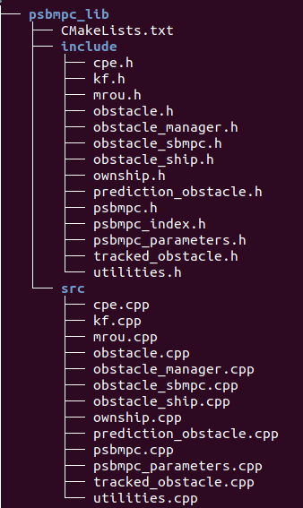

# PSB-MPC on the CPU

 This repository implements the Probabilistic Scenario-based MPC in C/C++. The algorithm is an extended and improved version of the original one posed in [[1]](#1). This library runs purely on the CPU. 

Several test functions exist under cybercolav_cxx/src/tests to showcase that the different library modules work as intented, and can be used for debugging or to make yourself familiar with the library. By opening the CMakeLists.txt files one can specify the module one wish to test. 

To use the library, for cmake, simply use the "add_subdirectory(/path/to/psbmpc_lib)" command, and link the corresponding target to your executable test file. Then, change directory to either debug or release, and build using standard cmake commands for either a debug or release build. 

## Dependencies

- Matlab C API for the debugging and plotting functionality.
- Eigen >= 3.3.7

## Overall Structure
The library for the CPU-implementation has the following structure (and similar for the GPU-version)

 

with an explanation of the modules (classes) below: 

### PSBMPC

 Main class of the library, implements the collision avoidance algorithm. Tuning is until now done in its constructor, but one can implement a read function to easily upload tuning changes via other files. 

The main function to use is the **calculate_optimal_offsets(..)** function, which requires the following **inputs**: 

- Planned guidance references for surge and course
- The waypoints that the own-ship is supposed to follow (curved/continuous path following is not implemented yet)
- The current time own-ship state (3DOF) 
- Nearby static obstacles, parameterized as for instance polygons, lines or similar. Not fully specified yet.
- A data structure Obstacle_Data containing dynamic obstacle information.

and has the following **outputs**:

- Optimal surge and course modification to the planned guidance references
- A predicted trajectory for the own-ship when implementing the optimal avoidance maneuver(s).
- Obstacle_Data: Some parts of the Obstacle_Data is modified by the PSB-MPC (predicted relative hazard levels for each obstacle)

### PSBMPC_Parameters

 contains all PSB-MPC parameters in a class, which should be modified according to tuning changes. The class has get/set functionality for each parameter according to an index file "psbmpc_index.h", and uses limits on double and integer type parameters to assure that the setting of these parameters makes sense. Work could although be done to make the get/set functionality even better. 

### Obstacle Manager

 Is the class responsible for updating dynamic obstacle information, taking the following inputs in its main update functionality: 

- Nearby obstacle states, an aggregated matrix with columns of  where the first 4 variables are the north and east position and velocity, respectively. The A, B, C, D parameters are the square approximation of the obstacle's dimensions, and ID is its indentification number.
- The corresponding covariance information or uncertainty associated with the estimates/measurement on , flattened into a 16-element vector. 
- The corresponding intention probabilities for the obstacle, obtained by some intention inference module. If the PSB-MPC is configured to not consider intentions, these inputs are not used.
- The corresponding a priori probability of the obstacle being COLREGS compliant, obtained by some intention inference module. If the PSB-MPC is configured to not consider intentions, these inputs are not used.

and also updates the current situation type that the own-ship is in, wrt to each obstacle, and also transitional variables (if an obstacle is passed by, is head on, is ahead, is overtaking the own-ship etc.).

 An Obstacle_Data structure containing this dynamic obstacle information is sent to the PSBMPC at each COLAV iteration. 

### Obstacle

The obstacle class maintains information about the obstacle, in addition to its predicted trajectories and PSB-MPC cost function related parameters. Organized into a inheritance hierarchy with

- Obstacle : Base class holding general information
	- Tracked_Obstacle : Holding tracking and prediction related information and modules. This is the object maintained by the PSB-MPC to keep track of the nearby obstacles. 
	- Prediction_Obstacle: **Not to be used yet**. More minimalistic derived class than the Tracked_Obstacle, intended for use by obstacles in the PSB-MPC prediction when they have enabled their own collision avoidance system
	- (Cuda_Obstacle: For the GPU version we also have a tailor made derived class for use in the CUDA kernels, which needs special care. **Not complete yet**)

### Obstacle_Ship 

 This module implements a minimal kinematic module for the motion of a nearby obstacle with guidance and control, for use in the Obstacle SB-MPC predictions when the PSB-MPC enables obstacles to have their own collision avoidance system. The guidance is based on using the Speed over Ground (SOG) and Course over Ground (COG) for the obstacle directly, with some first order time constant delay.  

The model is on the form  

  
  
  
  

### Obstacle_SBMPC

A simple SB-MPC meant for use by obstacles in the PSB-MPC prediction when considering intelligent obstacles. **Not tested nor finished yet**, so should not be used. 

### Ownship

This module implements a 3DOF surface vessel model with guidance and control as used in for instance <https://ntnuopen.ntnu.no/ntnu-xmlui/handle/11250/2625756>. Should naturally match the underlying vessel.

### KF

This is a linear Kalman-filter module used when obstacle states are received from a tracker node, to enable more robustness for the PSB-MPC against track loss. [[3]](#3) 

### MROU

This is the Mean-reverting Ornstein-Uhlenbeck process used for the prediction of the independent obstacle trajectories and covariance. 

### CPE

This is the Collision Probability Estimator used in the PSB-MPC predictions. Has incorporated two methods, one based on the Cross-Entropy method for estimation (reference will be underway soon enough), and another based on [[2]](#2). The estimator is sampling-based. Estimates the probability with pairs of trajectories (of the own-ship and a nearby obstacle) as inputs. 

### Utilities

 Inlined functions commonly used across multiple modules, gathered in one file. 

## References

<a id="1">[1]</a>  Johansen, T. A., Perez, T., and Cristofaro, A., "Ship collision avoidance and COLREGS compliance using simulation-based control behavior selection with predictive hazard assessment" IEEE
Transactions on Intelligent Transportation Systems, vol. 17, no. 12, pp. 3407-3422, Dec. 2016.

<a id="2">[2]</a>  Tengesdal, T., Johansen, T. A., and Brekke, E. (2020). "Risk-based Maritime Autonomous Collision Avoidance Considering Obstacle Intentions." 2020 23rd International Conference on Information Fusion (FUSION), South Africa.

<a id="3">[3]</a> Kufoalor, D. K. M., Wilthil, E., Hagen, I. B., Brekke E. F. and Johansen, T. A. (2019). "Autonomous COLREGSs-Compliant Decision Making using Maritime Radar Tracking and Model Predictive Control" 2019 18th European Control Conference (ECC).

 Trym Tengesdal, 8. October 2020.  

