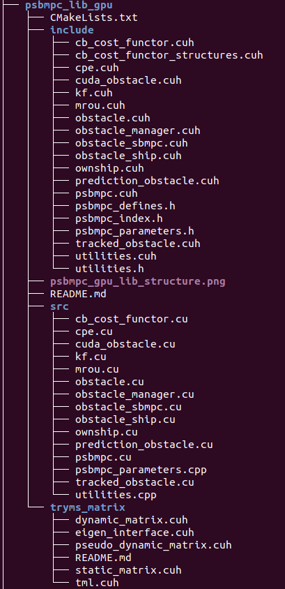

# PSB-MPC on the GPU

 This is the Probabilistic Scenario-based MPC in C/C++, where the most time-critical part of the MPC is implemented in CUDA to allow for performance gains through parallelization.  

To use the library, for cmake, simply use the "add_subdirectory(/path/to/psbmpc_lib_gpu)" command, and link the corresponding target to your executable test file. Then, change directory to either debug or release, and build using standard cmake commands for either a debug or release build. 

Note that the amount of memory you need on your GPU to run the algorithm will increase alot with the number of maneuvers (and the set of different maneuver types) you consider in the prediction horizon. Around 4 GB is sufficient for using 3 or less maneuvers.

 

## Dependencies

- Matlab C API is used for the debugging and plotting functionality.
- Eigen >= 3.3.7 release is used for the CPU and GPU version.
- CUDA and Thrust are necessary for the GPU version. I have used CUDA 11 and Thrust >= 1.9.9, other versions are not tested with.

## Overall Structure

The library for the GPU-implementation has the following structure  

 

with an explanation of the main modules (classes/structs) below: 

### PSBMPC

 Main class of the library, implements the collision avoidance algorithm.  

The main function to use is the **calculate_optimal_offsets(..)** function, which requires the following **inputs**: 

- Planned guidance references for surge and course
- The waypoints that the own-ship is supposed to follow (curved/continuous path following is not implemented yet)
- The current time own-ship state (3DOF) 
- Nearby static obstacles, parameterized as for instance polygons, lines or similar. Not fully specified yet.
- A data structure Obstacle_Data containing dynamic obstacle information.

and has the following **outputs**:

- Optimal surge and course modification to the planned guidance references
- A predicted trajectory for the own-ship when implementing the optimal avoidance maneuver(s).
- Obstacle_Data: Some parts of the Obstacle_Data is modified by the PSB-MPC (predicted relative hazard levels for each obstacle)

### PSBMPC_Parameters

 TUNING SHOULD BE DONE HERE. Contains all PSB-MPC parameters in a class, which should be modified according to tuning changes. The class has get/set functionality for each parameter according to an index file "psbmpc_index.h", and uses limits on double and integer type parameters to assure that the setting of these parameters makes sense. Work could although be done to make the get/set functionality even better. 

Note that the amount of control behaviours (function of the amount of maneuvers and different maneuver types considered) that can be considered on the GPU, is highly limited by the amount of memory available on the GPU, as some data structures (for instance the CPE class) need to be allocated and transferred to each thread (host to device transfer). 
 

## CB Cost Functor

 Special case C++ class/struct which has overloaded the **operator(..)**. This functor is used to evaluate the cost of following one particular control behaviour. The functor is ported to the gpu, where each thread will run the **operator(..)** to evaluate the cost of a certain control behaviour. The **operator(..)** function takes as input the index of the control behaviour considered, and the avoidance maneuver vector (offset sequence) considered in this control behaviour, and returns the cost associated with this control behaviour. 

### CB Cost Functor Structures 

 Defines read-only data for GPU threads that is needed in the **CB_Cost_Functor**, which needs to be sent from the host to the device. A subset of the PSB-MPC parameters are defined in a struct here, and also a struct which gathers diverse types of data for use on the GPU. 

## Obstacle Manager

 Is the class responsible for updating dynamic obstacle information, taking the following inputs in its main update functionality: 

- Nearby obstacle states, an aggregated matrix with columns of  where the first 4 variables are the north and east position and velocity, respectively. The A, B, C, D parameters are the square approximation of the obstacle's dimensions, and ID is its indentification number.
- The corresponding covariance information or uncertainty associated with the estimates/measurement on , flattened into a 16-element vector. 
- The corresponding intention probabilities for the obstacle, obtained by some intention inference module. If the PSB-MPC is configured to not consider intentions, these inputs are not used.
- The corresponding a priori probability of the obstacle being COLREGS compliant, obtained by some intention inference module. If the PSB-MPC is configured to not consider intentions, these inputs are not used.

and also updates the current situation type that the own-ship is in, wrt to each obstacle, and also transitional variables (if an obstacle is passed by, is head on, is ahead, is overtaking the own-ship etc.).

 An Obstacle_Data structure containing this dynamic obstacle information is sent to the PSBMPC at each COLAV iteration. 

### Obstacle

The obstacle class maintains information about the obstacle, in addition to its predicted trajectories and PSB-MPC cost function related parameters. Organized into a inheritance hierarchy with

- Obstacle : Base class holding general information
	- Tracked_Obstacle : Holding tracking and prediction related information and modules. This is the object maintained by the PSB-MPC to keep track of the nearby obstacles. 
	- Prediction_Obstacle: **Not to be used yet**. More minimalistic derived class than the Tracked_Obstacle, intended for use by obstacles in the PSB-MPC prediction when they have enabled their own collision avoidance system
	- Cuda_Obstacle: Used as a GPU-friendly data container of relevant Tracked_Obstacle data needed on the GPU. Read-only when processing on the GPU

### Obstacle_Ship 

 This module implements a minimal kinematic module for the motion of a nearby obstacle with guidance and control, for use in the Obstacle SB-MPC predictions when the PSB-MPC enables obstacles to have their own collision avoidance system. The guidance is based on using the Speed over Ground (SOG) and Course over Ground (COG) for the obstacle directly, with some first order time constant delay.  

The model is on the form  

  
  
  
  

### Obstacle_SBMPC

A simple SB-MPC meant for use by obstacles in the PSB-MPC prediction when considering intelligent obstacles. **Not tested nor finished yet**, so should not be used. 

### Ownship

This module implements a 3DOF surface vessel model with guidance and control as used in for instance <https://ntnuopen.ntnu.no/ntnu-xmlui/handle/11250/2625756>. Should naturally match the underlying vessel. **NOTE**: Differs from the CPU-version`s Ownship class, this one is designed to minimize memory usage on the GPU. 

### KF

This is a linear Kalman-filter module used when obstacle states are received from a tracker node, to enable more robustness for the PSB-MPC against track loss. [[3]](#3) 

### MROU

This is the Mean-reverting Ornstein-Uhlenbeck process used for the prediction of the independent obstacle trajectories and covariance. 

### CPE

This is the Collision Probability Estimator used in the PSB-MPC predictions. Has incorporated two methods, one based on the Cross-Entropy method for estimation (reference will be underway soon enough), and another based on [[2]](#2). The estimator is sampling-based, and is basically among others the main reason for trying to implement the PSB-MPC on the GPU. **NOTE** Changed to facilitate only static data allocation, and only considers one obstacle at the time. A grid of CPEs is allocated prior to running GPU code, where each thread will read/write to their own CPE object. "Optimized" for running on the GPU. 

### Utilities

 Inlined functions commonly used across multiple modules, gathered in one file. 

## Tryms_matrix (Tryms shitty matrix library)
Custom matrix library made specifically for usage of matrices in CUDA kernels, as I did not find another satisfactory third-party solution for this. HOpefully, Eigen will have better CUDA support in the future, which is unfortunately very limited today. **NOTE:** This library should be used with care, as it is only tested for a subset of all "typical matrix functionality", i.e. only the operations currently used in the PSB-MPC GPU run code. 

The library implements three matrix type containers:
- Static_Matrix: Fixed sized matrices
- Pseudo_Dynamic_Matrix (PDMatrix): (Fixed size) Matrix used to store larger amounts of data, with a compile-time known max number of rows and columns
- Dynamic_Matrix: Matrix container for data with  varying size

Only the fixed size matrices are used currently, because dynamic memory allocation on the gpu sucks. Thus, the "dynamic_matrix.cuh" file is **NOT USED**. 

## References

<a id="1">[1]</a>  Johansen, T. A., Perez, T., and Cristofaro, A., "Ship collision avoidance and COLREGS compliance using simulation-based control behavior selection with predictive hazard assessment" IEEE
Transactions on Intelligent Transportation Systems, vol. 17, no. 12, pp. 3407-3422, Dec. 2016.

<a id="2">[2]</a>  Tengesdal, T., Johansen, T. A., and Brekke, E. (2020). "Risk-based Maritime Autonomous Collision Avoidance Considering Obstacle Intentions." in 2020 23rd International Conference on Information Fusion (FUSION), South Africa, in press.

<a id="3">[3]</a> Kufoalor, D. K. M., Wilthil, E., Hagen, I. B., Brekke E. F. and Johansen, T. A. (2019). "Autonomous COLREGSs-Compliant Decision Making using Maritime Radar Tracking and Model Predictive Control" 2019 18th European Control Conference (ECC).

 Trym Tengesdal, 19. oktober 2020.  

